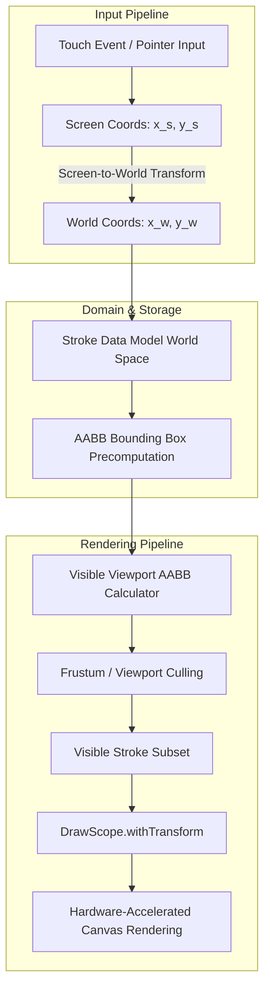

# Bloom Infinite Canvas Implementation Plan

## 1. Executive Summary

This plan outlines the architecture, mathematical model, performance optimizations, and step-by-step implementation for upgrading **Bloom** from a fixed-screen canvas to an unbounded **Infinite Canvas** ($\mathbb{R}^2$ coordinate space).

---

## 2. Core Architecture & Mathematical Models



### 2.1 Coordinate Systems
* **Screen / Viewport Space $(x_s, y_s)$**: Hardware pixel coordinates relative to the Compose `Canvas` composable $[0, W] \times [0, H]$.
* **World Space $(x_w, y_w)$**: Continuous Cartesian plane spanning $(-\infty, +\infty)$ where all stroke geometry is persisted.

### 2.2 Transformations
```kotlin
// Screen -> World
fun screenToWorld(screenPoint: Offset, scale: Float, offset: Offset): Offset {
    return Offset(
        x = (screenPoint.x - offset.x) / scale,
        y = (screenPoint.y - offset.y) / scale
    )
}

// World -> Screen
fun worldToScreen(worldPoint: Offset, scale: Float, offset: Offset): Offset {
    return Offset(
        x = worldPoint.x * scale + offset.x,
        y = worldPoint.y * scale + offset.y
    )
}
```

### 2.3 Pivot-Centroid Pinch & Pan
When zooming with two fingers, the zoom focal point must remain pinned beneath the gesture centroid:
$$\text{offset}_{\text{new}} = \text{centroid} - (\text{centroid} - \text{offset}_{\text{old}}) \times \frac{\text{scale}_{\text{new}}}{\text{scale}_{\text{old}}} + \Delta\text{pan}$$

Zoom boundary constraints:
$$\text{scale} \in [0.1\text{x}, 10.0\text{x}]$$

---

## 3. Key Feature Specifications

### 3.1 Infinite Background Rendering
* **Problem**: Current grid/dot rendering stops at device boundaries $[0, W] \times [0, H]$.
* **Solution**:
  1. Compute world viewport bounds:
     $$x_{\min} = \frac{-\text{offsetX}}{\text{scale}}, \quad x_{\max} = \frac{W - \text{offsetX}}{\text{scale}}$$
     $$y_{\min} = \frac{-\text{offsetY}}{\text{scale}}, \quad y_{\max} = \frac{H - \text{offsetY}}{\text{scale}}$$
  2. Modulo-align grid starting points:
     $$x_{\text{start}} = \lfloor x_{\min} / \text{spacing} \rfloor \times \text{spacing}$$
     $$y_{\text{start}} = \lfloor y_{\min} / \text{spacing} \rfloor \times \text{spacing}$$
  3. Draw lines/dots within `DrawScope.withTransform` block.
  4. Implement Level-of-Detail (LOD): Sub-grid lines fade in when $\text{scale} > 1.5\text{x}$ and primary grid lines scale gracefully.

### 3.2 Viewport Culling & Path Caching (Performance)
* **AABB Bounding Boxes**: Compute `Rect(left, top, right, bottom)` for each stroke when finalized and store with the stroke.
* **Spatial Culling**: Only render strokes where:
  $$\text{stroke.bounds.overlaps}(\text{viewportWorldBounds})$$
* **Cached Bézier Paths**: Cache the calculated `Path` object in memory to eliminate Bézier curve re-computation per frame.

### 3.3 Vector-Based Eraser
* **Current Issue**: Fake eraser draws lines matching the background color, breaking over grids or exports.
* **Solution**: Real vector eraser tests line-segment collision with existing strokes in World coordinates ($O(N)$ with AABB pre-filtering) and deletes the intersected strokes.

### 3.4 Navigation HUD & Minimap
1. **Zoom Indicator Pill**: Floating pill showing current zoom percentage (e.g. `100%`) with single-tap to reset to $1.0\text{x}$.
2. **Fit-to-Content Action**: Automatically animates viewport to fit the union bounding box of all strokes with 48dp padding.
3. **Radar Minimap**: Semi-transparent corner overview rendering thumbnail shapes of all strokes and a red rectangle indicating the current viewport position.

### 3.5 Bounding Box High-Res PNG Export
* Instead of capturing only the visible screen, calculate the total content bounding box of all strokes.
* Render to an offscreen bitmap sized to the content bounds (up to 4096px max) with background and export full high-res image.

---

## 4. File-by-File Implementation Plan

```
app/src/main/java/com/vibenote/app/
├── domain/
│   └── model/
│       ├── Stroke.kt              # Add bounds Rect & cached Path
│       └── Note.kt                # Add viewportOffset & viewportZoom
├── presentation/
│   └── canvas/
│       ├── CanvasTransform.kt     # Coordinate conversions, bounds & matrix math
│       ├── CanvasViewModel.kt     # World-space stroke management, vector erase, fit-content
│       └── CanvasScreen.kt        # Multi-touch gesture pipeline, infinite grid, HUD & minimap
```

### Detailed File Changes

#### 1. CanvasTransform.kt (New File)
- `screenToWorld(point, scale, offset)` & `worldToScreen(point, scale, offset)`
- `calculateViewportWorldBounds(size, scale, offset): Rect`
- `calculateContentBounds(strokes: List<Stroke>): Rect?`
- `calculateFitTransform(contentBounds, viewportSize): Pair<Float, Offset>`
- Line-segment intersection and point-to-segment distance algorithms for vector erasing.

#### 2. Stroke.kt
- Add `val bounds: Rect = Rect.Zero`
- Add helper method `fun computeBounds(): Rect`

#### 3. CanvasViewModel.kt
- Add `viewportScale`, `viewportOffsetX`, `viewportOffsetY` to `CanvasState`.
- Add `eraseAt(worldPoint: Offset, radius: Float)` for real vector erasing.
- Add `fitToContent(viewportSize: Size)` to center and frame all content.
- Update `exportAsPng` to render the complete content bounding box.

#### 4. CanvasScreen.kt
- Update gesture detector:
  - Disambiguate single-pointer drawing vs multi-pointer pinch/pan.
  - Transform all drawing input positions into World coordinates.
- Replace fixed background drawing with infinite tiled grid/dot rendering.
- Apply `withTransform { translate(offsetX, offsetY); scale(scale) }` for hardware-accelerated drawing.
- Add HUD overlay: Zoom badge + "Fit to Content" + Minimap overview.

---

## 5. Verification & Testing Strategy

1. **Coordinate Math Tests**: Unit test screen $\leftrightarrow$ world transformations at various scales and offsets.
2. **Gesture Precision**: Verify finger drawing matches stroke rendering accurately at $0.2\text{x}$, $1.0\text{x}$, and $5.0\text{x}$ zoom.
3. **Panning to Infinities**: Verify smooth rendering when panned to extreme coordinates $(\pm 100,000\text{px})$.
4. **Culling Benchmark**: Measure frame rendering times with 2,000+ strokes to confirm 60+ FPS performance.
5. **Full Export Quality**: Verify exported PNG contains all drawn strokes across the entire infinite board with no clipping.
